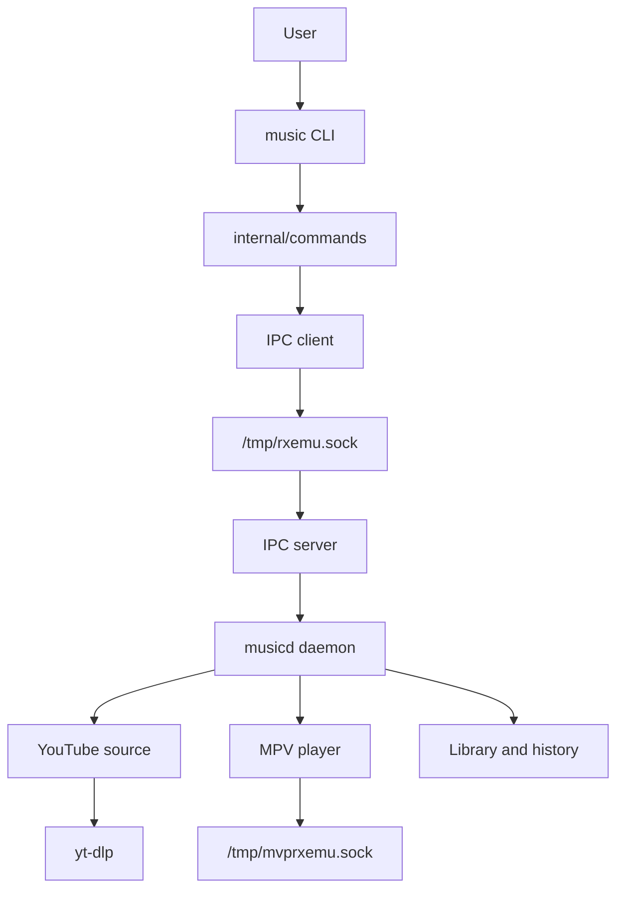

# Rxemu

> [!WARNING]
> **Rxemu is under active development.** The project is experimental and its
> commands, IPC protocol, configuration, and internal architecture may change
> without notice. It is not ready for production use.

Rxemu is a terminal music player written in Go. It uses a client-daemon
architecture: the `music` command sends requests to `musicd` through a Unix
socket, while the daemon manages playback through a persistent MPV process.
YouTube searches and URL metadata resolution are handled by `yt-dlp`.

## Current features

Rxemu currently supports:

- Searching YouTube by title.
- Playing a result from the latest search.
- Playing a URL directly.
- Pausing, resuming, and stopping playback.
- Displaying information about the current track.
- Changing or setting the playback volume.
- Seeking relatively or to an absolute position.
- Receiving basic MPV events such as file loading and playback completion.

The following areas are still incomplete:

- Persistent configuration and playback history.
- A complete playback queue.
- Consistent CLI errors and exit codes.
- Stable installation and release packages.
- Fully documented audio support outside WSLg.

## Architecture



The project provides two executables:

- `music`: a short-lived CLI client that parses user input and sends a request
  to the daemon.
- `musicd`: a persistent process that owns playback state, handles requests,
  resolves media, and controls MPV.

## Repository layout

```text
.
├── cmd/
│   ├── music/                 # CLI client entry point
│   └── musicd/                # Daemon entry point
├── internal/
│   ├── commands/              # Cobra commands and subcommands
│   │   └── helper/            # CLI formatting helpers
│   ├── config/                # Paths and configuration defaults
│   ├── daemon/                # Playback state and use cases
│   ├── ipc/                   # Unix socket client, server, and protocol
│   ├── library/               # History and library work in progress
│   └── source/                # Search and URL resolution through yt-dlp
├── Dockerfile.dev             # Go, MPV, yt-dlp, Deno, and development tools
├── compose.yaml               # Development container and WSLg audio mount
├── go.mod
└── go.sum
```

### Dependency flow

```text
cmd/music  -> commands -> IPC client
cmd/musicd -> config + daemon + IPC server + source
daemon     -> player + source + IPC protocol
player     -> MPV IPC
source     -> yt-dlp
```

Packages under `internal/` can only be imported from within this Go module.
This prevents implementation details from accidentally becoming a public Go
API.

## Requirements

Running Rxemu without Docker currently requires:

- Go 1.25 or a version compatible with the current `go.mod`.
- MPV.
- `yt-dlp`.
- Deno for JavaScript extraction support used by `yt-dlp`.
- An audio server supported by MPV.

Check the installed tools with:

```bash
go version
mpv --version
yt-dlp --version
deno --version
```

## Development with Docker

The development image installs Go, MPV, `yt-dlp`, Deno, Delve, and common
terminal tools. Compose mounts the repository at `/app` and configures the
WSLg PulseAudio socket.

Start an interactive development container from the project root:

```bash
docker compose run --rm --build --name rxemu-dev dev
```

Start the daemon inside that container:

```bash
go run ./cmd/musicd
```

Open another host terminal and enter the same container:

```bash
docker exec -it rxemu-dev bash
```

The client can now communicate with the running daemon:

```bash
go run ./cmd/music status
```

The `--rm` option removes the container after its main shell exits.

### Audio on WSLg

The current Compose configuration exposes the WSLg PulseAudio server:

```yaml
environment:
  PULSE_SERVER: unix:/mnt/wslg/PulseServer

volumes:
  - /mnt/wslg:/mnt/wslg
```

Before debugging Rxemu playback, verify MPV audio directly inside the
container:

```bash
mpv --no-video --ao=pulse <audio-file>
```

If MPV reports `Connection refused`, the problem is the connection between the
container and WSLg/PulseAudio rather than Rxemu's IPC protocol.

## Running without Docker

Start the daemon in one terminal:

```bash
go run ./cmd/musicd
```

Use the client from another terminal:

```bash
go run ./cmd/music status
```

Both executables can also be built locally:

```bash
mkdir -p bin
go build -o bin/music ./cmd/music
go build -o bin/musicd ./cmd/musicd
```

Start the compiled daemon:

```bash
./bin/musicd
```

Then use the compiled client from another terminal:

```bash
./bin/music status
```

## CLI commands

The following examples assume the CLI binary is named `music`. During
development, replace `music` with `go run ./cmd/music`.

### Search for tracks

```bash
music search "Daft Punk One More Time"
music search "Daft Punk" --limit 10
```

Search results are numbered and stored in daemon memory as the latest search.

### Play a search result

```bash
music play 1
```

This plays result `1` from the latest search.

### Play a URL

```bash
music play "https://www.youtube.com/watch?v=..." --url
```

The short flag is also available:

```bash
music play "https://www.youtube.com/watch?v=..." -u
```

### Playback controls

```bash
music pause
music stop
music status
```

`pause` toggles between paused and playing states.

### Seek controls

```bash
music seek 10
music seek -10
music seekabs 60
```

- `seek` moves by a relative number of seconds.
- `seekabs` moves to an absolute position in seconds.

### Volume controls

```bash
music volume up
music volume down
music volume set 75
```

The `volume` command has the `vol` alias:

```bash
music vol up
music vol down
music vol set 50
```

The volume subcommands also register `increase`, `decrease`, `+`, and `-`
aliases where appropriate.

## IPC protocol

> The entries below are internal IPC commands, not HTTP endpoints. Rxemu does
> not currently expose a REST server or network port.

The CLI and daemon exchange JSON messages over this Unix socket:

```text
/tmp/rxemu.sock
```

MPV uses a separate internal control socket:

```text
/tmp/mvprxemu.sock
```

### Request

```json
{
  "command": "play",
  "args": ["1"]
}
```

### Successful response

```json
{
  "ok": true,
  "message": "Playing"
}
```

### Error response

```json
{
  "ok": false,
  "error": "track number is out of range"
}
```

### Search response

```json
{
  "ok": true,
  "tracks": [
    {
      "id": "video-id",
      "title": "Track title",
      "artist": "Channel name",
      "duration": 240,
      "url": "https://www.youtube.com/watch?v=video-id"
    }
  ]
}
```

### Available IPC commands

| Command | Arguments | Description |
| --- | --- | --- |
| `status` | None | Returns current track information |
| `search` | Query and limit | Searches for tracks and stores the latest results |
| `play` | Numeric ID | Plays a result from the latest search |
| `playurl` | URL | Resolves and plays a URL directly |
| `pause` | None | Toggles pause and resume |
| `stop` | None | Stops playback |
| `vol-up` | None | Increases volume |
| `vol-down` | None | Decreases volume |
| `vol-set` | Volume from `0` to `100` | Sets an explicit volume |
| `seek` | Seconds | Seeks relative to the current position |
| `seek-abs` | Seconds | Seeks to an absolute position |

The protocol structures are defined in `internal/ipc/protocol.go`. The server
accepts one request per connection, invokes the daemon handler, and returns a
JSON response.

## Current configuration

Configuration currently uses defaults defined directly in the source code:

| Setting | Current value |
| --- | --- |
| Rxemu socket | `/tmp/rxemu.sock` |
| MPV IPC socket | `/tmp/mvprxemu.sock` |
| History path | `/tmp/history-rxemu.sock` |
| Initial volume | `100` |

`internal/config` does not load a user configuration file yet. These defaults
may change as development continues.

## Contributing

Issues, suggestions, and contributions are welcome while Rxemu is under active
development. When reporting a problem, include:

- Operating system and environment, such as Linux, WSL, or Docker.
- Go, MPV, and `yt-dlp` versions.
- The command that was executed.
- Relevant output from both `musicd` and the client.

## License

This project is distributed under the terms in [LICENSE](LICENSE).
